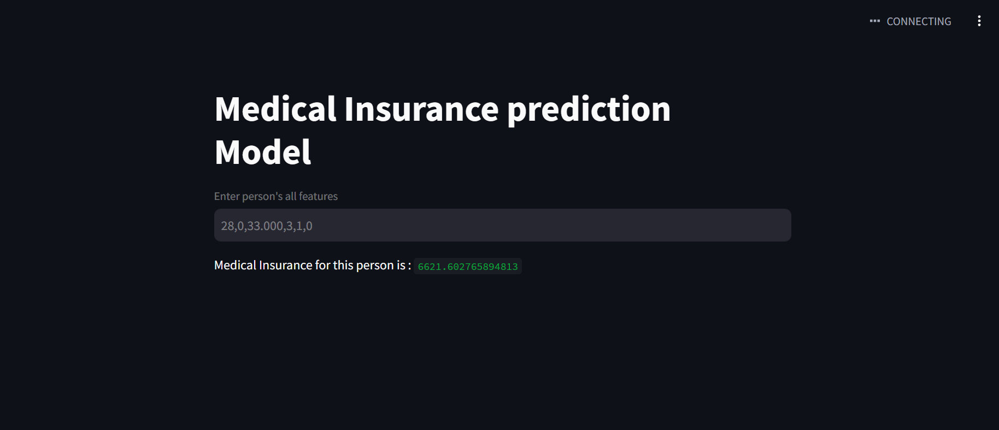

# Medical Insurance Prediction 

This is a simple project based on supervised machine learning alogorithm using linear regression to predict the price of the insurance.

### Parameters used 

* age 
* gender
* children
* region 
* cost
* smoker 

### Output and application 

In this we have give the parameters in only numerical value and the model prediction accurage is 70%(as the dataset is small). 